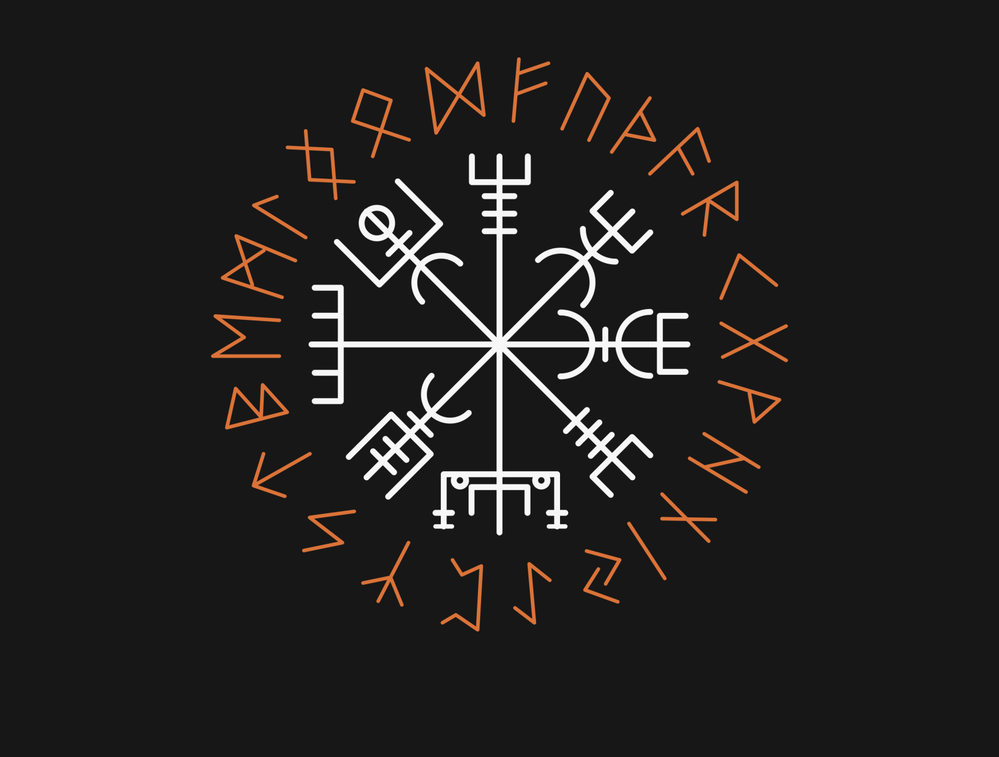

# Odin [](https://github.com/panoskarajohn/Odin/actions/workflows/dotnet.yml)

# Introduction

This is a playground, trying to become a decent solution. 
This is in progress, trying to put everything together. 

# Run the app

Run the following commands

```
➜  Odin (master)
docker-compose -f infra.yml up -d
docker-compose up -d
```

You can send requests to odin/event.api
```
➜  Odin (master)ds                                                                                                                                                                                                                                                                                                
CONTAINER ID   IMAGE                                        COMMAND                  CREATED          STATUS          PORTS                                                                                                         NAMES
43dabc161fd3   odin/event.api:linux-latest                  "dotnet Event.Api.dll"   44 seconds ago   Up 43 seconds   443/tcp, 0.0.0.0:1000->80/ tcp                                                                                 events
5cdf6dbadec6   grafana/grafana                              "/run.sh"                23 minutes ago   Up 23 minutes   0.0.0.0:30091->3000/tcp                                                                                       dev_grafana
52d2113cd618   odin-prometheus                              "/bin/prometheus --c…"   23 minutes ago   Up 23 minutes   0.0.0.0:9090->9090/tcp                                                                                        prometheus
17c72df72a33   redis                                        "docker-entrypoint.s…"   23 minutes ago   Up 23 minutes   0.0.0.0:6379->6379/tcp                                                                                        redis
22f61b679405   rabbitmq:3-management                        "docker-entrypoint.s…"   23 minutes ago   Up 23 minutes   4369/tcp, 5671/tcp, 0.0.0.0:5672->5672/tcp, 15671/tcp, 15691-15692/tcp, 25672/tcp, 0.0.0.0:15672->15672/tcp   odin-rabbitmq-1
928f8264620b   mcr.microsoft.com/mssql/server:2017-latest   "/opt/mssql/bin/nonr…"   23 minutes ago   Up 23 minutes   0.0.0.0:1433->1433/tcp                                                                                        odin-sqlserver-1
c0c14fadbc0e   mongo                                        "docker-entrypoint.s…"   23 minutes ago   Up 23 minutes   0.0.0.0:27017->27017/tcp                                                                                      mongo
d009f1eae98c   datalust/seq                                 "/bin/seqentry"          23 minutes ago   Up 23 minutes   443/tcp, 5341/tcp, 45341/tcp, 0.0.0.0:5341->80/tcp                                                            seq
```

## Send Requests
I have attached some postman requests on the root of the project
Have fun! :)

# Community:
If you don't like what you see do not hesitate to open an issue or create a pull request of your own.

This is a repo with a lot of stolen code, maybe a bit modified. 

Mostly from some repositories which I really like:

* https://github.com/dotnet-architecture/eShopOnContainers
* https://github.com/meysamhadeli/Airline-Microservices
* https://github.com/devmentors/Pacco

Inspired a lot from https://github.com/devmentors/

And since the name of the project is Odin. 
The below image is Vegvisir also known as the Viking compass. May this repo guide you 😁
[](https://github.com/panoskarajohn/)


